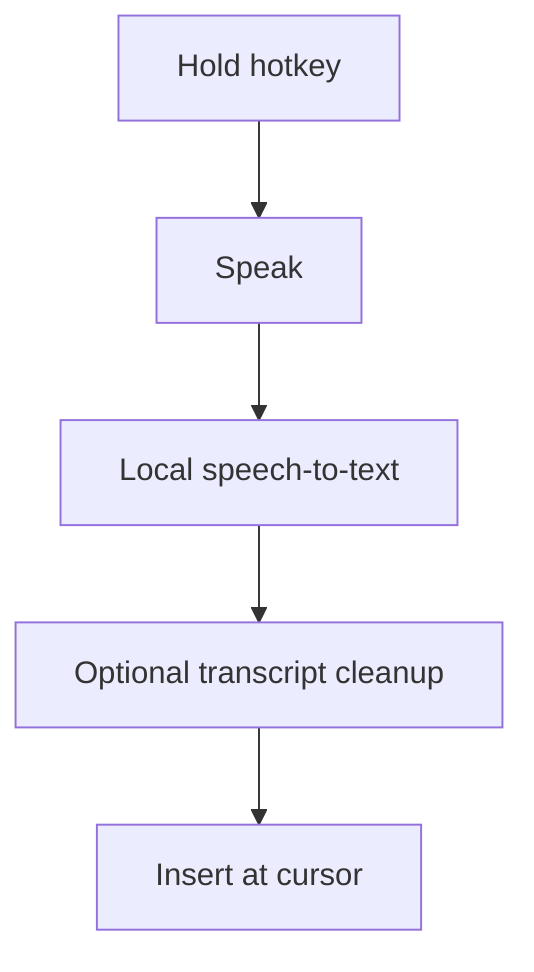
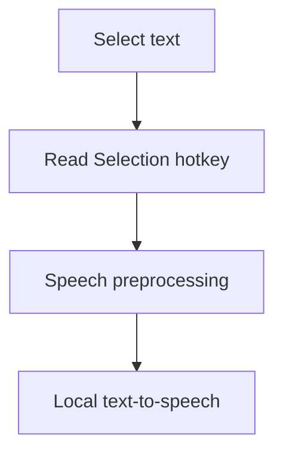
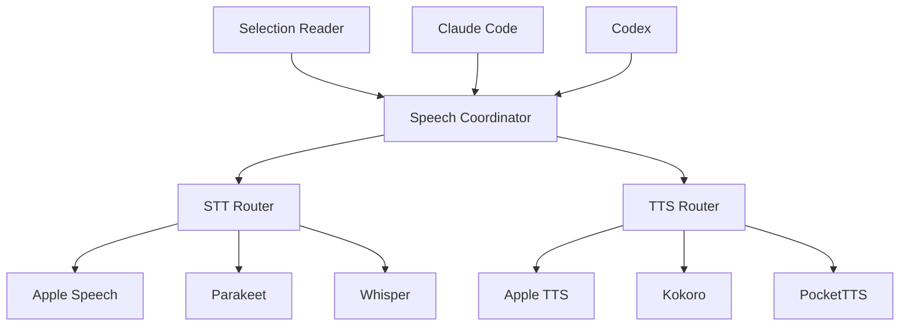
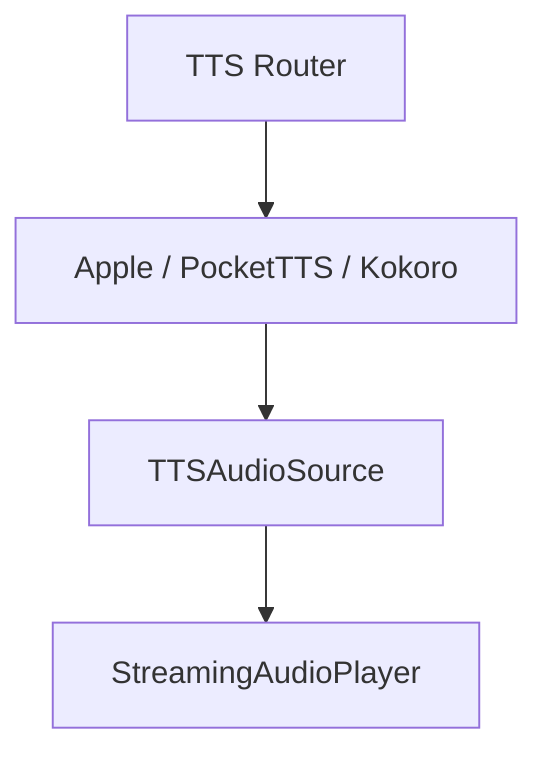

# Relay

**Voice in, voice out, anywhere on your Mac.**

Relay is a local-first macOS voice interface for dictation, text-to-speech, and coding-agent workflows.

The goal is to make tools such as Claude Code and Codex feel conversational without requiring them to provide their own voice interface.

## What Relay Does

### Speech In

Hold a configurable hotkey, speak, and Relay transcribes your voice locally and inserts the result at the current cursor.



While you speak, an on-screen pill shows live interim transcription that grows, wraps, and scrolls as more words arrive. The pill is toggleable in General settings.

### Speech Out

Select text anywhere on macOS, press a configurable hotkey, and Relay reads it aloud.



Relay shows an **Activity Overlay** — an on-screen capsule reflecting speaking status and the active backend. Speech is serialized through an **automatic queue**, so concurrent agent responses queue rather than overlap. A session-aware **Replay Last** action replays the focused session's last reply, else the global latest reply, else the last spoken/selected text.

### Agent Integrations

Relay can integrate with coding agents such as:

- Claude Code
- Codex

When the currently focused agent finishes responding, Relay can automatically read the response aloud.

Background agent sessions remain silent — but the last-active session keeps reading when you tab away to a non-agent app, provided no other agent session is focused and nothing else is currently speaking (otherwise the response queues).

## Principles

- Local-first
- No account required
- No server required
- No transcript or audio history by default
- Configurable hotkeys
- Replaceable STT and TTS backends
- Graceful backend fallback
- Integrations remain separate from the speech core
- Conservative automatic speech: a session speaks only if it is confidently focused, or it is the most-recently-active session and no other session is confidently focused; if focus is uncertain and no session was ever looked at, stay silent

## Architecture

Relay separates speech processing from integrations.



Integrations feed normalized events into Relay. They do not implement speech themselves.

### Text-to-Speech pipeline

TTS backends are pure audio producers. The `TTS Router` selects a backend and asks it for a
`TTSAudioSource`; a single shared `StreamingAudioPlayer` owns all playback (start, pause/resume,
stop, and level metering). No backend owns its own speaker.



Kokoro handles long responses by phonemizing the whole text once and synthesizing it as a sequence
of phoneme-safe chunks, so the first segment starts playing before the entire response is
synthesized and speech crosses chunk boundaries without dropped or repeated sentences.

## Terminal and Session Support

Relay is designed to work independently of any particular terminal or multiplexer.

Examples include:

```text
Ghostty → Claude Code
Ghostty → Codex
Ghostty → tmux → Claude Code
Ghostty → tmux → Codex
Ghostty → Herdr → Claude Code
Terminal.app → tmux → Codex
```

Terminal-specific and multiplexer-specific focus detection is handled through separate resolvers.

## Settings

Relay's settings are organized into tabs:

- **General** — live-transcription pill, Activity Overlay style, launch-at-login
- **Dictation** — speech-to-text behavior plus expandable providers with shared Download, Select, and Remove model controls
- **Keybinds** — configurable hotkeys
- **TTS** — expandable providers using the same model controls, with Select and Test actions for each provider's voices
- **Integrations** — coding-agent auto-read
- **Permissions** — microphone and accessibility grants, plus microphone diagnostics (an Open Microphone Settings button and the last capture's frame count / sample rate) to help recover a stale mic grant after a rebuild

## Project Status

All three phases have shipped, covered by a green XCTest suite (~880 tests).

Recent work: TTS now runs as a unified source/player pipeline (backends produce a `TTSAudioSource`; one shared `StreamingAudioPlayer` owns playback), with Kokoro long-form phoneme chunking. Speech-model management is unified across STT and TTS providers — one download/select/remove flow plus in-settings voice previews. The playback watchdog is inactivity-based, so long responses are never cut off while they keep making progress.

1. **Core**
   - macOS app
   - hotkeys
   - selected-text reading
   - speech-to-text
   - text-to-speech
   - backend routing and fallback

2. **Agent Integrations**
   - integration event protocol
   - Claude Code
   - Codex

3. **Session Intelligence**
   - concurrent sessions
   - focused-session detection
   - generic terminal support
   - tmux
   - optional Herdr integration

## Documentation

```text
docs/
└── superpowers/
    ├── specs/
    │   ├── 2026-09-11-relay-design.md
    │   ├── 2026-09-14-relay-activity-overlay-design.md
    │   ├── 2026-09-15-relay-settings-remodel-and-kokoro-tts-design.md
    │   └── 2026-09-16-live-transcription-spike-findings.md
    └── plans/
        ├── 2026-09-11-relay-phase-1-core-implementation-plan.md
        ├── 2026-09-11-relay-phase-2-agent-integrations-implementation-plan.md
        ├── 2026-09-11-relay-phase-3-session-intelligence-implementation-plan.md
        ├── 2026-09-14-relay-phase-1-5-activity-overlay-implementation-plan.md
        ├── 2026-09-15-relay-keybinds-smart-recorder-implementation-plan.md
        ├── 2026-09-15-relay-phase-1-6-settings-remodel-implementation-plan.md
        ├── 2026-09-15-relay-phase-1-7-kokoro-tts-implementation-plan.md
        └── 2026-09-15-relay-pockettts-backend-implementation-plan.md
```

## Tech Stack

- Swift
- SwiftUI
- macOS
- AVFoundation
- macOS Accessibility APIs
- XcodeGen (`project.yml` → `Relay.xcodeproj`) and XCTest
- FluidAudio models for STT/TTS (Parakeet, Kokoro, PocketTTS)

Speech backends are abstracted so models and providers can be replaced without changing the rest of Relay.

## Privacy

Relay is local-first.

By default:

- recorded audio is discarded after transcription
- transcripts are not stored
- agent responses are not logged
- session state is kept in memory
- local speech backends do not send content off-device

Any future network-backed provider must be explicitly enabled by the user.

## License

Not yet selected.
