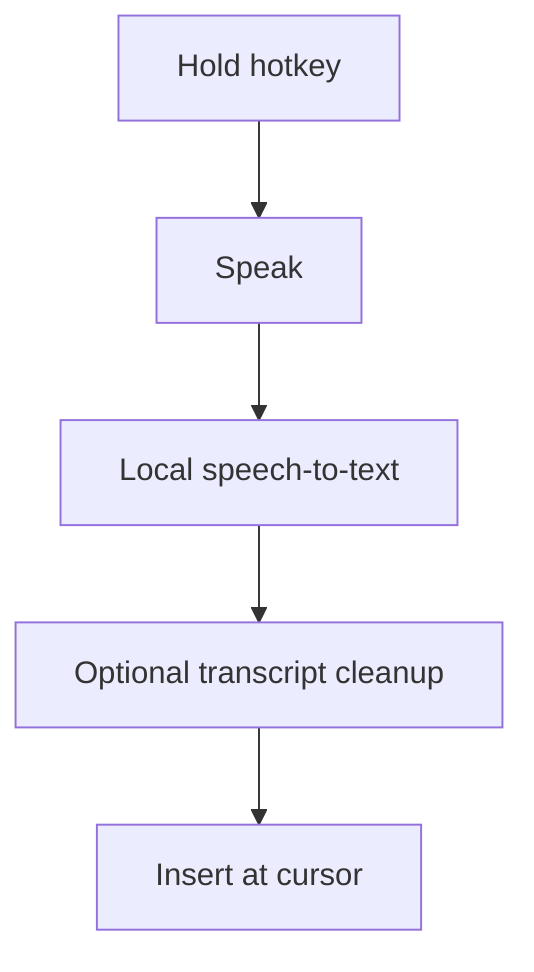
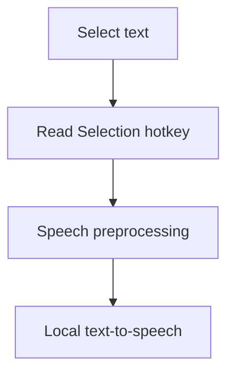
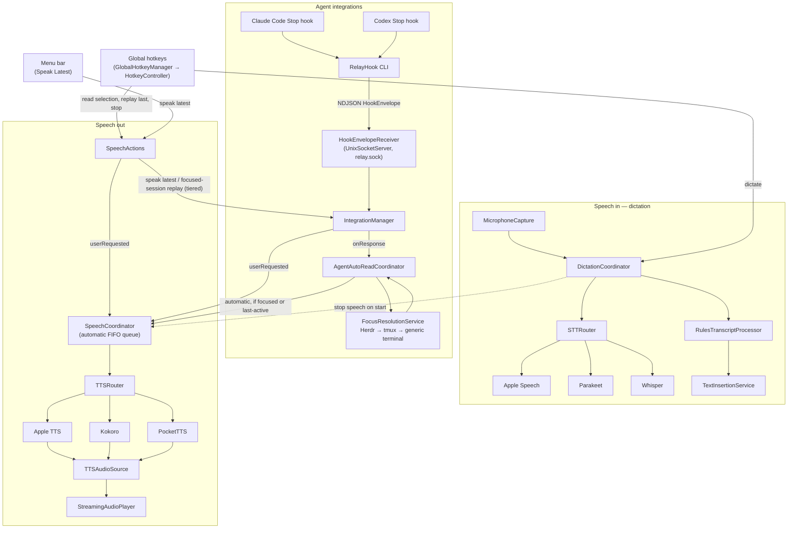
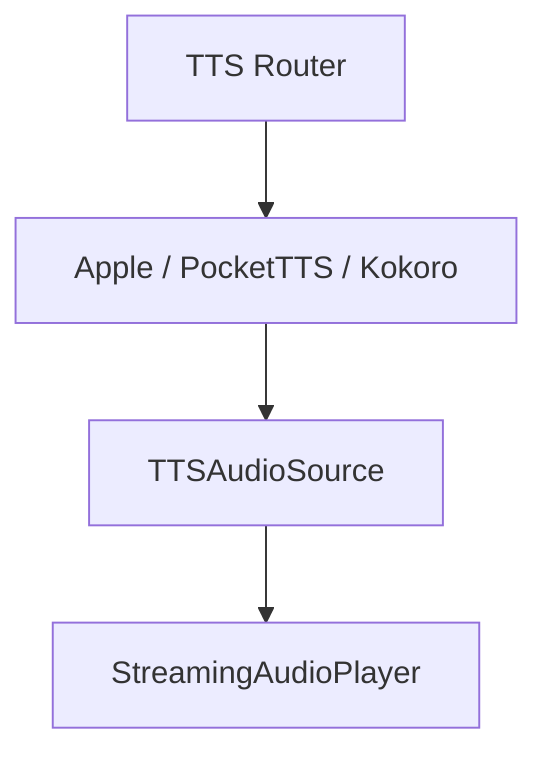

# Relay

**Voice in, voice out, anywhere on your Mac.**

Relay is a local-first macOS voice interface for dictation, text-to-speech, and coding-agent workflows.

The goal is to make tools such as Claude Code and Codex feel conversational without requiring them to provide their own voice interface.

## What Relay Does

### Speech In

Hold a configurable hotkey, speak, and Relay transcribes your voice locally and inserts the result at the current cursor.



While you speak, an on-screen pill shows live interim transcription that grows, wraps, and scrolls as more words arrive. The pill is toggleable in General settings.

### Speech Out

Select text anywhere on macOS, press a configurable hotkey, and Relay reads it aloud.



Relay shows an **Activity Overlay** — an on-screen capsule reflecting speaking status and the active backend. Speech never overlaps: automatic agent responses wait in a FIFO queue behind whatever is playing, while anything you ask for explicitly (Read Selection, Replay Last) interrupts immediately. A session-aware **Replay Last** action replays the focused session's last reply, else the global latest reply, else the last spoken/selected text.

### Agent Integrations

Relay can integrate with coding agents such as:

- Claude Code
- Codex

When the currently focused agent finishes responding, Relay can automatically read the response aloud.

Background agent sessions remain silent — but the last-active session keeps reading when you tab away to a non-agent app, provided no other agent session is confidently focused. Whether a response is spoken depends only on focus, never on whether something is already playing:

- A response that passes the focus check is queued as **automatic** speech. If nothing is speaking it starts at once; otherwise it waits in a first-in-first-out queue (up to 8 responses, oldest dropped first) and plays when the current speech finishes.
- **Read Selection**, **Replay Last** and **Speak Latest** interrupt current speech and clear the queue.
- Starting dictation stops current speech and clears the queue.
- A response that fails the focus check is not spoken, but it stays available to **Replay Last** / **Speak Latest**.

## Principles

- Local-first
- No account required
- No server required
- No transcript or audio history by default
- Configurable hotkeys
- Replaceable STT and TTS backends
- Graceful backend fallback
- Integrations remain separate from the speech core
- Conservative automatic speech: a session speaks only if it is confidently focused, or it is the most-recently-active session and no other session is confidently focused; if focus is uncertain and no session was ever looked at, stay silent

## Architecture

Relay separates speech processing from integrations. Integrations only turn agent hook output into normalized `AgentResponseEvent`s; they never touch audio. `RelayRuntime.makeProduction()` is the composition root that builds and wires everything below. `AppModel` is a thin facade over the sub-models it builds from that runtime: `SettingsController`, `PermissionsModel`, `IntegrationSetupModel`, `SpeechBackendsModel` (which owns two `BackendListModel`s, one per speech direction), `SpeechActions`, and `HotkeyController`.



**Dictation (speech in).** A hotkey press starts `DictationCoordinator`, which stops any current speech, captures microphone audio, and transcribes it through `STTRouter`. The router tries the backends in the configured order (`sttBackendOrder`) and falls back when one is unavailable. The transcript goes through `RulesTranscriptProcessor` and is inserted at the cursor by `TextInsertionService`. Live interim text feeds the overlay pill. Dictation never goes through `SpeechCoordinator`.

**Agent responses (speech out).** Each agent's `Stop` hook runs the `RelayHook` helper (installed at `~/Library/Application Support/Relay/bin/RelayHook`). The helper forwards the hook payload as a single `HookEnvelope` line over the Unix socket `~/Library/Application Support/Relay/relay.sock`. The Debug build uses `~/Library/Application Support/Relay Debug/` instead (see [Debug and Release builds](#debug-and-release-builds)). `HookEnvelopeReceiver` validates it. `IntegrationManager` decodes it with the provider's `StopHookIntegration` (`.claudeCode` / `.codex`), keeps it in memory as the latest response, and hands it to `AgentAutoReadCoordinator`. The auto-read coordinator records the session, resolves focus, and speaks (mode `.automatic`) only if the session is confidently focused, or if nobody is currently focused and it is the most-recently-active session.

**User-requested speech.** Read Selection, Replay Last, Speak Latest and voice previews all go through `SpeechActions`, the single owner of every explicit speech action. Read Selection reads the selection and speaks it directly; Replay Last resolves a session-aware target (the focused session's reply, else the global latest reply via `IntegrationManager`, else the last spoken/selected text); Speak Latest asks `IntegrationManager` for the latest response. Every path submits a `.userRequested` request, which `SpeechCoordinator` starts immediately, clearing the queue.

**Playback.** `SpeechCoordinator` serializes all speech (see [Agent Integrations](#agent-integrations) for queueing rules) and drives `TTSRouter`, which walks the backends in `ttsBackendOrder`, asks the first available one for a `TTSAudioSource`, and hands it to the single shared `StreamingAudioPlayer`. Every current TTS backend builds its source as a `PipedTTSAudioSource`: synthesis runs as a producer task that yields PCM into a bounded `TTSAudioPipe`, so a backend can never race ahead of playback and fill memory. Model-backed STT and TTS backends (Parakeet, Kokoro, PocketTTS) load their on-device model sessions through a shared `ModelSessionLoader`, which de-duplicates concurrent loads and coordinates downloading vs. loading a backend already has locally.

### Text-to-Speech pipeline

TTS backends are pure audio producers. The `TTS Router` selects a backend and asks it for a
`TTSAudioSource`; a single shared `StreamingAudioPlayer` owns all playback (start, pause/resume,
stop, and level metering). No backend owns its own speaker.



Kokoro handles long responses by phonemizing the whole text once and synthesizing it as a sequence
of phoneme-safe chunks, so the first segment starts playing before the entire response is
synthesized and speech crosses chunk boundaries without dropped or repeated sentences.

## Terminal and Session Support

Relay is designed to work independently of any particular terminal or multiplexer.

Examples include:

```text
Ghostty → Claude Code
Ghostty → Codex
Ghostty → tmux → Claude Code
Ghostty → tmux → Codex
Ghostty → Herdr → Claude Code
Terminal.app → tmux → Codex
```

Terminal-specific and multiplexer-specific focus detection is handled through separate resolvers.

## Build & setup

Requirements: an Apple silicon Mac on macOS 26+, Xcode 26+ (the macOS 26 SDK), and Homebrew.

1. **Install XcodeGen.**

   ```sh
   brew install xcodegen
   ```

   CI pins XcodeGen 2.46.0 (`.github/workflows/ci.yml`). A different version can rewrite `Relay.xcodeproj` and fail CI's drift check.

2. **Create the local code-signing identity.** Both builds (Relay and Relay Debug) and their embedded `RelayHook` helper are signed with a self-signed certificate named exactly **`Relay Local Development`** (`CODE_SIGN_IDENTITY` in `project.yml`). A stable signature keeps macOS privacy grants (Microphone, Accessibility, Input Monitoring) attached to the app across rebuilds. An ad-hoc signature changes on every build and quietly invalidates them.

   In **Keychain Access**:
   1. Choose **Keychain Access → Certificate Assistant → Create a Certificate…**
   2. Name: `Relay Local Development`. Identity Type: **Self Signed Root**. Certificate Type: **Code Signing**. Click **Create**, then **Continue** / **Done**. Keep the default *login* keychain.
   3. Double-click the new certificate (under *login → My Certificates*), expand **Trust**, set **Code Signing** to **Always Trust**, close the window and enter your password.

   Verify:

   ```sh
   security find-identity -v -p codesigning | grep "Relay Local Development"
   ```

   You should see one line like `1) 5A3F… "Relay Local Development"`. The first build may ask to let `codesign` use the key. Choose **Always Allow**.

3. **Generate the Xcode project.**

   ```sh
   xcodegen generate
   ```

   `Relay.xcodeproj` is committed. After editing `project.yml`, regenerate it and commit both files.

4. **Build and install.**

   ```sh
   scripts/install.sh
   ```

   This builds Release (arm64) into `/tmp/relay-build`, quits the installed Relay (a running Relay Debug is left alone), atomically replaces `/Applications/Relay.app`, and relaunches it. Relaunching also refreshes the stable hook helper at `~/Library/Application Support/Relay/bin/RelayHook`. Set `RELAY_NO_LAUNCH=1` to skip the relaunch. For day-to-day development use the Debug build from Xcode, and run this script when you want to promote your changes to the everyday app (see [Debug and Release builds](#debug-and-release-builds)).

5. **Grant permissions** to `/Applications/Relay.app` in **System Settings → Privacy & Security**. The **Permissions** tab in Relay's settings shows the current state and links to each pane.

   | Permission | Used for |
   |---|---|
   | Microphone | dictation |
   | Accessibility | global hotkeys, reading the selection, inserting text at the cursor |
   | Input Monitoring | listening for global hotkeys |
   | Speech Recognition | only when the Apple Speech backend is selected |

   Grants belong to a bundle id plus its signing certificate. Release (`dev.relaymac.Relay`, "Relay") and Debug (`dev.relaymac.Relay.debug`, "Relay Debug") each have their own entries in every pane, so grant each build once. Because both are signed with `Relay Local Development`, rebuilding either one keeps its grants, and `scripts/install.sh` promotes a new Release build without new prompts. Run everyday Relay from `/Applications/Relay.app`, not from a copy in `/tmp`.

   If hotkeys only work while the app is focused, or dictation records silence with no orange microphone dot after a rebuild, that build's grant is stale. Toggle it off and on in the relevant pane, or reset only that build's grants and grant again:

   ```sh
   # Release (/Applications/Relay.app)
   tccutil reset Accessibility dev.relaymac.Relay
   tccutil reset ListenEvent dev.relaymac.Relay            # Input Monitoring
   tccutil reset Microphone dev.relaymac.Relay
   tccutil reset SpeechRecognition dev.relaymac.Relay

   # Debug ("Relay Debug", run from Xcode)
   tccutil reset Accessibility dev.relaymac.Relay.debug
   tccutil reset ListenEvent dev.relaymac.Relay.debug      # Input Monitoring
   tccutil reset Microphone dev.relaymac.Relay.debug
   tccutil reset SpeechRecognition dev.relaymac.Relay.debug
   ```

   Then relaunch that build (`open /Applications/Relay.app`, or Run in Xcode for Debug) and grant again when macOS asks.

6. **Install the agent hooks.** Open **Settings → Integrations** and click **Install** for Claude Code and/or Codex. Relay adds a `Stop` hook that runs `~/Library/Application Support/Relay/bin/RelayHook` to `~/.claude/settings.json` (or `$CLAUDE_CONFIG_DIR`) and to `~/.codex/hooks.json` (or `$CODEX_HOME`). Relay never removes other hooks. Relay Debug installs its own entry, pointing at `~/Library/Application Support/Relay Debug/bin/RelayHook`, next to Release's. Installing or uninstalling in one build never touches the other build's entry. Both entries fire on every agent response, and each helper delivers only to its own build's socket. A build that isn't running just misses the response. **If both builds are running with auto-read on, both will speak the same response** — turn auto-read off in whichever build you aren't actively using.
   - **Codex:** Codex runs a non-managed hook only after you trust it. Open `/hooks` inside Codex and trust the Relay hook. Relay never edits Codex's trust state. If `config.toml` sets `[features] hooks = false`, the install refuses.
   - Turn on **auto-read** in the same tab to have focused agent responses read aloud.

### Debug and Release builds

Relay Debug and Relay are two separate apps that can be installed and run side by side. The menu bar icon shows a small **DEV** badge next to the waveform glyph while Relay Debug is running, so the two are distinguishable at a glance:

| | Relay (Release) | Relay Debug |
|---|---|---|
| Bundle id | `dev.relaymac.Relay` | `dev.relaymac.Relay.debug` |
| How it's built | `scripts/install.sh` → `/Applications/Relay.app` | **Run** in Xcode (Debug configuration) |
| Privacy grants and settings | its own | its own |
| Socket, lock, stable hook helper | `~/Library/Application Support/Relay/` | `~/Library/Application Support/Relay Debug/` |
| Agent hook entries | its own | its own (coexists with Release's) |
| Downloaded speech models | `~/Library/Application Support/Relay/Models/` (shared) | same |

Both are signed with `Relay Local Development`, so each keeps its grants across rebuilds. Typical loop: make changes and try them in **Relay Debug**, then run `scripts/install.sh` to promote them to `/Applications/Relay.app`, which keeps its existing grants.

### Tests and lint

```sh
xcodebuild test -scheme Relay -destination 'platform=macOS' CODE_SIGNING_ALLOWED=NO
scripts/lint.sh            # swift-format findings (config: .swift-format); --fix rewrites in place
```

`CODE_SIGNING_ALLOWED=NO` lets the tests run without the signing identity, as CI does. CI (`.github/workflows/ci.yml`) runs on pull requests and on pushes to `main`. It checks that `Relay.xcodeproj` matches `project.yml`, runs the lint (blocking — a finding fails the build), then builds and runs the tests.

## Settings

Relay's settings are organized into tabs:

- **General** — live-transcription pill, Activity Overlay style, launch-at-login
- **Dictation** — speech-to-text behavior plus expandable providers with shared Download, Select, and Remove model controls
- **Keybinds** — configurable hotkeys
- **TTS** — expandable providers using the same model controls, with Select and Test actions for each provider's voices
- **Integrations** — coding-agent auto-read
- **Permissions** — microphone and accessibility grants, plus microphone diagnostics (an Open Microphone Settings button and the last capture's frame count / sample rate) to help recover a stale mic grant after a rebuild

Settings are versioned (schema `n`, currently 2) and decode field-by-field, so a saved blob with an unreadable or missing field never resets the rest. There is no downgrade path: if you ever reinstall an older Relay build after running a newer one, it won't recognize the current per-backend voice selections (`voiceByBackend`) and falls back to each backend's default voice — every other setting still decodes normally.

## Project Status

All three phases have shipped, covered by a green XCTest suite (~1070 tests).

Recent work: TTS now runs as a unified source/player pipeline (backends produce a `TTSAudioSource`; one shared `StreamingAudioPlayer` owns playback), with Kokoro long-form phoneme chunking. Speech-model management is unified across STT and TTS providers — one download/select/remove flow plus in-settings voice previews. The playback watchdog is inactivity-based, so long responses are never cut off while they keep making progress.

1. **Core**
   - macOS app
   - hotkeys
   - selected-text reading
   - speech-to-text
   - text-to-speech
   - backend routing and fallback

2. **Agent Integrations**
   - integration event protocol
   - Claude Code
   - Codex

3. **Session Intelligence**
   - concurrent sessions
   - focused-session detection
   - generic terminal support
   - tmux
   - optional Herdr integration

## Documentation

Design specs, implementation plans, and feasibility spikes live under `docs/superpowers/`:

```text
docs/superpowers/
├── specs/    design documents (dated; older ones carry a "Historical — superseded" banner)
├── plans/    task-by-task implementation plans, one per feature or cleanup wave
└── spikes/   feasibility investigations and their results
```

The code is the source of truth. When a spec disagrees with it, trust the [Architecture](#architecture) section above.

## Tech Stack

- Swift
- SwiftUI
- macOS
- AVFoundation
- macOS Accessibility APIs
- XcodeGen (`project.yml` → `Relay.xcodeproj`) and XCTest
- On-device speech models: FluidAudio (Parakeet STT; Kokoro and PocketTTS TTS), WhisperKit (Whisper STT), and Apple's Speech / AVSpeechSynthesizer

Speech backends are abstracted so models and providers can be replaced without changing the rest of Relay.

## Privacy

Relay is local-first.

By default:

- recorded audio is discarded after transcription
- transcripts are not stored
- agent responses are not logged
- session state is kept in memory
- local speech backends do not send content off-device

Any future network-backed provider must be explicitly enabled by the user.

## License

Not yet selected.
