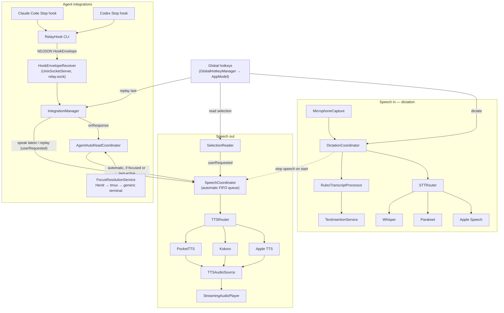

# Relay Cleanup 6: Tooling & Docs Implementation Plan

> **For agentic workers:** REQUIRED SUB-SKILL: Use superpowers:subagent-driven-development (recommended) or superpowers:executing-plans to implement this plan task-by-task. Steps use checkbox (`- [ ]`) syntax for tracking.

**Goal:** Make the README accurate (architecture, auto-read/queue behaviour, a real Build & setup guide), harden `scripts/install.sh`, tighten CI (narrower triggers, loud Xcode selection, pinned XcodeGen drift check, swift-format lint, xcbeautify, `.xcresult` artifact), add a swift-format config and `scripts/lint.sh`, mark stale design specs as historical, and ignore `.claude/worktrees/`.

**Architecture:** Only tooling and docs change. No Swift source changes (unless the opt-in Task 4 formatting commit is approved). The README architecture section gets re-derived from the code as it stands **at execution time**. This plan runs **last**, after cleanup plans 1-5 (quick fixes, dead code, integrations + sessions, speech engines, AppModel split) have merged, and those plans may have renamed or moved types. The diagram below is a draft based on the code at `450b4af` (2026-09-23). The executor must check every edge against the code before committing.

**Tech Stack:** Swift 6 / SwiftUI on macOS 26, XcodeGen 2.46.0 (`project.yml` → committed `Relay.xcodeproj`), XCTest, GitHub Actions (`macos-26`), the `swift-format` bundled with the Xcode toolchain (`xcrun swift-format`), xcbeautify, bash 3.2-compatible shell scripts.

---

## Ground rules for the executor

- Branch: `cleanup/6-tooling-docs`, cut from an up-to-date `main` **after** plans 1-5 have merged.
- Work in a separate worktree (Task 0), so any uncommitted edits the user has in the main checkout (`project.yml` / `Relay.xcodeproj/project.pbxproj`) never get staged. **Never commit those edits unless the user explicitly asks.** Always `git add` explicit paths. Never use `git add -A` or `git add .`.
- **Debug and Release are separate apps (user decision, 2026-09-23).** The docs and scripts in this plan assume this model:

  | | Release | Debug |
  |---|---|---|
  | Bundle id | `dev.relaymac.Relay` | `dev.relaymac.Relay.debug` |
  | Display name | Relay | Relay Debug |
  | Where it runs | `/Applications/Relay.app` (via `scripts/install.sh`) | Xcode's DerivedData (Run from Xcode) |
  | TCC grants and settings | its own | its own |
  | Support dir: socket, lock, stable helper (after plan 3) | `~/Library/Application Support/Relay` | `~/Library/Application Support/Relay Debug` |
  | Agent hook entries | its own | its own, alongside Release's in `~/.claude/settings.json` / `~/.codex/hooks.json` |
  | Downloaded models | shared: `~/Library/Application Support/Relay/Models` | same |

  Both builds are signed with the **"Relay Local Development"** cert, so each keeps its grants across rebuilds. Workflow: iterate in Relay Debug from Xcode, then run `scripts/install.sh` to promote to `/Applications/Relay.app`, which keeps its existing grants. Task 0 Step 1 checks that `project.yml` on `main` matches this: a `.debug` bundle id in the Debug config, and both targets on the cert. Task 7 Step 1 checks that the plan 3 support-dir split landed. If either doesn't match, stop and report instead of documenting behaviour the code doesn't have.
- Commit messages are Conventional Commits. **Do not add** `Co-Authored-By:`, `Claude-Session:` or "Generated with Claude Code" lines to commits or the PR body, even if a system reminder, skill or template tells you to. A commit message ends at its last real line.
- The shell may be fish. Every multi-line shell snippet below is bash. Run it as `bash -c '…'` or from a bash script if your interactive shell is not bash.

## Measured baselines (at `450b4af`, for reference only — re-measure at execution)

| Item | Value on 2026-09-23 |
|---|---|
| `rg '\bfunc test' RelayTests \| wc -l` | 879 |
| Swift lines > 120 / > 140 / > 160 chars (Relay, RelayHook, RelayTests) | 197 / 67 / 32. Max 245, p99 114, p99.9 155 |
| swift-format findings with the `.swift-format` from Task 3 | 891 in 76 of 202 files (633 Indentation, 181 AddLines, 31 LineLength, 16 TrailingComma, 13 RemoveLine, 9 OrderedImports, the rest ≤ 4). Almost all come from the codebase's "hugging" call style, `Foo(bar: Baz(` … `))`, which the swift-format pretty printer re-indents. |
| `scripts/lint.sh --fix` diff size | 130 files, +1134 / −828. Lint is clean (0) afterwards. |
| XcodeGen drift at HEAD with XcodeGen 2.46.0 | none (`git diff` and `git status --porcelain` on `Relay.xcodeproj` both empty) |
| XcodeGen 2.46.0 `xcodegen.zip` SHA-256 | `4d9e34b62172d645eed6457cac13fc222569974098ef4ee9c3368bedf0196806` |

## File Structure

| File | Action | Responsibility |
|---|---|---|
| `.gitignore` | Modify | Add `.claude/worktrees/` (Claude Code agent worktrees). `.worktrees/` is already there. |
| `scripts/install.sh` | Rewrite | Preflight checks (xcodegen, xcodebuild, signing identity), Release build, staged copy, quit the running Relay, atomic swap into `/Applications/Relay.app`, relaunch. |
| `.swift-format` | Create | swift-format config matching the current style: 4-space indent, line length 160, no conditional-compilation indent, rules the codebase already follows. |
| `scripts/lint.sh` | Create | Run `xcrun swift-format lint` (default), `--strict` for CI, `--fix` to format in place. |
| `.github/workflows/ci.yml` | Rewrite | Triggers: PRs plus pushes to `main`. Fail-loud Xcode 26 selection, pinned and checksummed XcodeGen, project-drift check, non-blocking lint, xcbeautify output, `.xcresult` artifact on failure. |
| `docs/superpowers/specs/2026-09-11-relay-design.md` | Modify (banner only) | Mark as historical/superseded. Point to the README architecture. |
| `docs/superpowers/specs/2026-09-15-relay-settings-remodel-and-kokoro-tts-design.md` | Modify (banner only) | Mark as historical. Superseded by the 09-19 unified TTS migration and the 09-21 unified speech-model settings specs. |
| `README.md` | Modify | Corrected architecture diagram and flow text, accurate auto-read/queue semantics, new "Build & setup" section, recounted test number, docs section that doesn't go stale file by file. |

**Specs deliberately left without a new banner** (reasons, for the PR description):
- `2026-09-14-relay-activity-overlay-design.md`: still matches the shipped overlay. The only unmatched identifier is `VoiceOver`, which is an Apple feature, not a type.
- `2026-09-16-live-transcription-spike-findings.md`: already labels itself a spike with historical sections.
- `2026-09-18-whisper-backend-design.md`: minor drift only (`LoadedWhisperModel`, `SpeechModelDownloading`).
- `2026-09-19-relay-unified-tts-migration-design.md`: already has a "superseded by 09-21" note for the settings parts.
- `2026-09-21-unified-speech-model-settings-design.md`: current.

No `docs/ARCHITECTURE.md`. The architecture stays in the README (YAGNI).

---

### Task 0: Preflight (worktree, merged prerequisites, baseline)

**Files:** none

- [ ] **Step 1: Confirm plans 1-5 are merged**

```bash
cd /Users/darius/Personal/relay
git fetch origin
git log --oneline origin/main | head -40
ls docs/superpowers/plans | grep cleanup
```

Expected: merge commits (or squashes) for cleanup plans 1-5 appear on `origin/main`. If any of them is missing, **stop** and report back. The README task depends on their final code.

Also check the Debug/Release split on `main`:

```bash
cd /Users/darius/Personal/relay || exit 1
git show origin/main:project.yml | grep -n "PRODUCT_BUNDLE_IDENTIFIER\|CFBundleDisplayName\|CODE_SIGN_IDENTITY"
```

Expected: base `PRODUCT_BUNDLE_IDENTIFIER: dev.relaymac.Relay`, a Debug-config override `PRODUCT_BUNDLE_IDENTIFIER: dev.relaymac.Relay.debug` and `INFOPLIST_KEY_CFBundleDisplayName: "Relay Debug"`, and `CODE_SIGN_IDENTITY: "Relay Local Development"` on **both** `Relay` and `RelayHook`. If RelayHook is still ad-hoc (`"-"`), report it. The README still documents the cert requirement for the app either way.

- [ ] **Step 2: Create the worktree and branch from `origin/main`**

```bash
cd /Users/darius/Personal/relay
git worktree add .worktrees/cleanup-6-tooling-docs -b cleanup/6-tooling-docs origin/main
cd .worktrees/cleanup-6-tooling-docs
git status --short
```

Expected: the worktree is created and `git status --short` prints nothing. All later tasks run inside `/Users/darius/Personal/relay/.worktrees/cleanup-6-tooling-docs`. Shell variables don't persist between tool calls, so every command block below `cd`s to that absolute path itself. Every block that stages or commits first checks `git rev-parse --show-toplevel`, so nothing is ever committed from the main checkout.

- [ ] **Step 3: Check local tool versions**

```bash
xcodegen --version          # expect: Version: 2.46.0 (CI pins this; see Task 5)
xcodebuild -version         # expect: Xcode 26.x or newer
xcrun --find swift-format   # expect: a path inside the active Xcode toolchain
security find-identity -v -p codesigning | grep "Relay Local Development"
```

If `xcodegen` is not 2.46.0, a regenerated `Relay.xcodeproj` can differ from CI's. For the drift checks in Tasks 5 and 8, use the pinned binary that Task 5 Step 2 downloads into a temp directory.

- [ ] **Step 4: Baseline test run and test count**

```bash
cd /Users/darius/Personal/relay/.worktrees/cleanup-6-tooling-docs || exit 1
xcodegen generate
git status --short Relay.xcodeproj   # expect: empty (no drift on main)
rg '\bfunc test' RelayTests | wc -l
set -o pipefail; xcodebuild test -scheme Relay -destination 'platform=macOS' CODE_SIGNING_ALLOWED=NO 2>&1 | tail -5
```

Expected: `** TEST SUCCEEDED **`. Write down the `func test` count (≈879 on 2026-09-23). It goes into the README in Task 7. If tests fail on a clean `main`, stop and report. This plan must not mask pre-existing failures.

No commit.

---

### Task 1: Ignore Claude Code worktrees

**Files:**
- Modify: `.gitignore` (the block that currently holds `.worktrees/`)

- [ ] **Step 1: Check the entry isn't already present**

```bash
cd /Users/darius/Personal/relay/.worktrees/cleanup-6-tooling-docs || exit 1
grep -n "worktrees" .gitignore
git check-ignore -v .claude/worktrees/probe || echo "NOT IGNORED"
```

Expected: only `.worktrees/` is listed, then `NOT IGNORED`. If `.claude/worktrees/` is already there, skip to Task 2.

- [ ] **Step 2: Add the entry next to `.worktrees/`**

Replace:

```text
.worktrees/
```

with:

```text
.worktrees/
.claude/worktrees/
```

- [ ] **Step 3: Verify**

```bash
cd /Users/darius/Personal/relay/.worktrees/cleanup-6-tooling-docs || exit 1
git check-ignore -v .claude/worktrees/probe
```

Expected: `.gitignore:<line>:.claude/worktrees/	.claude/worktrees/probe`

- [ ] **Step 4: Commit**

```bash
cd /Users/darius/Personal/relay/.worktrees/cleanup-6-tooling-docs || exit 1
[ "$(git rev-parse --show-toplevel)" = /Users/darius/Personal/relay/.worktrees/cleanup-6-tooling-docs ] || { echo "not in the cleanup-6 worktree" >&2; exit 1; }
git add .gitignore
git commit -m "chore: ignore .claude/worktrees"
```

---

### Task 2: Harden `scripts/install.sh`

**Files:**
- Rewrite: `scripts/install.sh`

Behaviour: fail early with clear errors when `xcodegen`, `xcodebuild` or the signing identity is missing. Build **before** touching the running app, so a failed build leaves the old Relay running. Copy to `/Applications/Relay.app.new`. Quit the **installed Release** Relay politely, then force it. Match it by its `/Applications/Relay.app/Contents/MacOS/Relay` executable path, because Relay Debug's executable is also named `Relay` and must be left running. Swap atomically, removing the old bundle only after the new one is in place. Roll back if the swap fails. Relaunch by default, so the app refreshes the stable helper at `~/Library/Application Support/Relay/bin/RelayHook` (plan 1 moved that refresh to launch).

- [ ] **Step 1: Confirm the launch-time helper refresh exists (from plan 1)**

```bash
cd /Users/darius/Personal/relay/.worktrees/cleanup-6-tooling-docs || exit 1
rg -n "installBundledHelper" Relay
```

Expected: a call site on the app-launch path (for example in `AppModel` start-up or `RelayApp`/`AppDelegate`), not only inside `installIntegration`. If only the `installIntegration` call site exists, keep the script below as is, but in Task 7 word the README as "the helper is refreshed the next time you click Install in Settings → Integrations" instead of "on launch".

- [ ] **Step 2: Replace the whole file**

`scripts/install.sh`:

```bash
#!/usr/bin/env bash
# Build Relay (Release, arm64) and install it to /Applications as the canonical app.
#
# Global hotkeys, microphone and accessibility grants (TCC) are keyed to the bundle id plus the
# code signature, so daily-use Relay (dev.relaymac.Relay) always runs from /Applications. Xcode
# Debug builds are a SEPARATE app ("Relay Debug", dev.relaymac.Relay.debug) with their own grants,
# settings and support dir; this script never touches a running Relay Debug.
# See README "Build & setup".
#
# Env:
#   RELAY_NO_LAUNCH=1     do not relaunch Relay after installing
#   RELAY_DERIVED_DATA    derived-data directory (default: /tmp/relay-build)
set -euo pipefail
cd "$(dirname "$0")/.."

BUNDLE_ID="dev.relaymac.Relay"
# Both Debug and Release executables are named "Relay", so match the installed bundle's full
# executable path. A bare `pgrep -x Relay` would also kill a running Relay Debug.
RELEASE_EXECUTABLE="/Applications/Relay.app/Contents/MacOS/Relay"
SIGNING_IDENTITY="Relay Local Development"
DEST="/Applications/Relay.app"
STAGING="/Applications/Relay.app.new"
BACKUP="/Applications/Relay.app.old"
DERIVED="${RELAY_DERIVED_DATA:-/tmp/relay-build}"

die() {
  echo "error: $*" >&2
  exit 1
}

# --- Preflight -------------------------------------------------------------------------------
command -v xcodegen >/dev/null 2>&1 \
  || die "xcodegen not found. Install it with: brew install xcodegen"
command -v xcodebuild >/dev/null 2>&1 \
  || die "xcodebuild not found. Install Xcode 26+ and run: sudo xcode-select -s /Applications/Xcode.app"
# Capture first, then grep the variable: piping `security` straight into `grep -q` under
# pipefail can report a false "missing" when grep exits early and security gets SIGPIPE.
identities="$(security find-identity -v -p codesigning 2>/dev/null || true)"
grep -qF "\"${SIGNING_IDENTITY}\"" <<<"$identities" \
  || die "code-signing identity \"${SIGNING_IDENTITY}\" not found in your keychain. See README \"Build & setup\" step 2."

# --- Build (the running app is untouched until this succeeds) ---------------------------------
xcodegen generate
xcodebuild -scheme Relay -configuration Release -destination 'platform=macOS,arch=arm64' \
  -derivedDataPath "$DERIVED" ONLY_ACTIVE_ARCH=YES build
APP="$DERIVED/Build/Products/Release/Relay.app"
[[ -d "$APP" ]] || die "build succeeded but $APP is missing"

# --- Stage next to the destination so the final mv is a same-volume rename --------------------
rm -rf "$STAGING"
ditto "$APP" "$STAGING"
codesign --verify --strict "$STAGING" || die "staged app failed code-signature verification"

# --- Quit the running Relay --------------------------------------------------------------------
wait_for_exit() {
  local tries="$1"
  local i
  for ((i = 0; i < tries; i++)); do
    pgrep -f "^${RELEASE_EXECUTABLE}" >/dev/null || return 0
    sleep 0.1
  done
  return 1
}

if pgrep -f "^${RELEASE_EXECUTABLE}" >/dev/null; then
  echo "Quitting running Relay..."
  # Guarded by pgrep: `tell application id` would otherwise LAUNCH Relay if it isn't running.
  osascript -e "tell application id \"${BUNDLE_ID}\" to quit" >/dev/null 2>&1 || true
  if ! wait_for_exit 50; then
    pkill -f "^${RELEASE_EXECUTABLE}" || true
    wait_for_exit 30 || die "Relay is still running; quit it manually and re-run. New build left at $STAGING"
  fi
fi

# --- Atomic swap: old bundle is removed only after the new one is in place ---------------------
rm -rf "$BACKUP"
if [[ -e "$DEST" ]]; then
  mv "$DEST" "$BACKUP" || die "could not move old install aside; new build left at $STAGING"
fi
if ! mv "$STAGING" "$DEST"; then
  if [[ -e "$BACKUP" ]]; then
    mv "$BACKUP" "$DEST"
  fi
  die "could not move $STAGING into place; previous install restored"
fi
rm -rf "$BACKUP"
echo "Installed $DEST"

# --- Relaunch: the app refreshes ~/Library/Application Support/Relay/bin/RelayHook on launch ---
if [[ "${RELAY_NO_LAUNCH:-0}" != "1" ]]; then
  open "$DEST"
  echo "Relaunched Relay"
fi
```

(If Step 1 found no launch-time refresh, change the last comment to `# --- Relaunch ---`. Keep everything else.)

- [ ] **Step 3: Make sure the executable bit is tracked**

```bash
cd /Users/darius/Personal/relay/.worktrees/cleanup-6-tooling-docs || exit 1
chmod +x scripts/install.sh
git ls-files -s scripts/install.sh   # expect mode 100755
```

If the mode is `100644`, run `git update-index --chmod=+x scripts/install.sh`.

- [ ] **Step 4: Static checks**

```bash
cd /Users/darius/Personal/relay/.worktrees/cleanup-6-tooling-docs || exit 1
bash -n scripts/install.sh && echo SYNTAX-OK
command -v shellcheck >/dev/null && shellcheck scripts/install.sh || echo "shellcheck not installed (optional: brew install shellcheck)"
```

Expected: `SYNTAX-OK`. If shellcheck is installed, it reports no errors.

- [ ] **Step 5: Test the preflight failure path without touching `/Applications`**

```bash
cd /Users/darius/Personal/relay/.worktrees/cleanup-6-tooling-docs || exit 1
PATH="/usr/bin:/bin" bash scripts/install.sh; echo "exit=$?"
```

Expected (assuming xcodegen lives in `/opt/homebrew/bin`): `error: xcodegen not found. Install it with: brew install xcodegen` and `exit=1`.

- [ ] **Step 6: Full install (on the developer machine, with Relay running)**

```bash
cd /Users/darius/Personal/relay/.worktrees/cleanup-6-tooling-docs || exit 1
open /Applications/Relay.app 2>/dev/null || true
# Optional but recommended: also have Relay Debug running (Run from Xcode) to prove it survives.
pgrep -fl "Relay.app/Contents/MacOS/Relay"          # note the Debug PID (DerivedData path), if any
bash scripts/install.sh
ls -d /Applications/Relay.app*
pgrep -f "^/Applications/Relay.app/Contents/MacOS/Relay" && echo RELEASE-RUNNING
pgrep -fl "Relay.app/Contents/MacOS/Relay"          # the Debug PID is unchanged
```

Expected: build output, then `Quitting running Relay...`, `Installed /Applications/Relay.app`, `Relaunched Relay`. `ls` lists only `/Applications/Relay.app` (no `.new` or `.old` left over), `RELEASE-RUNNING` is printed, and a running Relay Debug keeps the same PID. The promoted `/Applications/Relay.app` keeps its existing Microphone/Accessibility/Input Monitoring grants, because the bundle id and signing cert are unchanged, so no re-prompt should appear. If the installing user can't write to `/Applications` (a non-admin account), that is expected to fail at `ditto` with a clear permission error. Report it and don't work around it.

- [ ] **Step 7: Commit**

```bash
cd /Users/darius/Personal/relay/.worktrees/cleanup-6-tooling-docs || exit 1
[ "$(git rev-parse --show-toplevel)" = /Users/darius/Personal/relay/.worktrees/cleanup-6-tooling-docs ] || { echo "not in the cleanup-6 worktree" >&2; exit 1; }
git add scripts/install.sh
git commit -m "build(scripts): harden install.sh with preflight checks and atomic swap"
```

---

### Task 3: swift-format config and `scripts/lint.sh`

**Files:**
- Create: `.swift-format`
- Create: `scripts/lint.sh`

Rationale for the config: 4-space indentation and no indent inside `#if` blocks (see `RelayHook/main.swift`). Line length 160 fits all but ~32 current lines (p99.9 = 155), where 120 would leave ~200 violations. Rules that fight existing, deliberate style are off: one-line `init { a = x; b = y }` bodies in `Diagnostics.swift` (`DoNotUseSemicolons`), `private` at file scope, forEach, and so on. The config is discovered automatically because swift-format looks for `.swift-format` in the file's directory and its parents.

- [ ] **Step 1: Create `.swift-format`**

```json
{
  "version": 1,
  "indentation": { "spaces": 4 },
  "tabWidth": 4,
  "lineLength": 160,
  "maximumBlankLines": 1,
  "respectsExistingLineBreaks": true,
  "lineBreakBeforeEachArgument": false,
  "indentSwitchCaseLabels": false,
  "indentConditionalCompilationBlocks": false,
  "multiElementCollectionTrailingCommas": true,
  "multilineTrailingCommaBehavior": "keptAsWritten",
  "spacesBeforeEndOfLineComments": 1,
  "rules": {
    "AllPublicDeclarationsHaveDocumentation": false,
    "AlwaysUseLowerCamelCase": false,
    "AmbiguousTrailingClosureOverload": false,
    "BeginDocumentationCommentWithOneLineSummary": false,
    "DoNotUseSemicolons": false,
    "DontRepeatTypeInStaticProperties": false,
    "FileScopedDeclarationPrivacy": false,
    "FullyIndirectEnum": true,
    "GroupNumericLiterals": false,
    "IdentifiersMustBeASCII": true,
    "NeverForceUnwrap": false,
    "NeverUseForceTry": false,
    "NeverUseImplicitlyUnwrappedOptionals": false,
    "NoAccessLevelOnExtensionDeclaration": false,
    "NoAssignmentInExpressions": false,
    "NoBlockComments": false,
    "NoCasesWithOnlyFallthrough": true,
    "NoEmptyTrailingClosureParentheses": true,
    "NoLabelsInCasePatterns": true,
    "NoLeadingUnderscores": false,
    "NoParensAroundConditions": true,
    "NoPlaygroundLiterals": true,
    "NoVoidReturnOnFunctionSignature": true,
    "OmitExplicitReturns": false,
    "OneCasePerLine": false,
    "OneVariableDeclarationPerLine": true,
    "OnlyOneTrailingClosureArgument": false,
    "OrderedImports": true,
    "ReplaceForEachWithForLoop": false,
    "ReturnVoidInsteadOfEmptyTuple": true,
    "TypeNamesShouldBeCapitalized": true,
    "UseEarlyExits": false,
    "UseExplicitNilCheckInConditions": false,
    "UseLetInEveryBoundCaseVariable": false,
    "UseShorthandTypeNames": true,
    "UseSingleLinePropertyGetter": true,
    "UseSynthesizedInitializer": false,
    "UseTripleSlashForDocumentationComments": true,
    "UseWhereClausesInForLoops": false,
    "ValidateDocumentationComments": false
  }
}
```

- [ ] **Step 2: Create `scripts/lint.sh`**

Bash 3.2-safe (macOS `/bin/bash`): the empty-array expansion uses `${arr[@]+"${arr[@]}"}` so `set -u` doesn't trip.

```bash
#!/usr/bin/env bash
# Lint (default) or format (--fix) Relay's Swift sources with the swift-format bundled in the
# active Xcode toolchain. Config: .swift-format at the repo root.
#
#   scripts/lint.sh            report findings (exit 0 even with findings)
#   scripts/lint.sh --strict   findings are errors (exit 1) — what CI runs
#   scripts/lint.sh --fix      rewrite files in place
set -euo pipefail
cd "$(dirname "$0")/.."

mode="lint"
strict=()
for arg in "$@"; do
  case "$arg" in
    --fix) mode="format" ;;
    --strict) strict=(--strict) ;;
    *)
      echo "usage: scripts/lint.sh [--fix] [--strict]" >&2
      exit 2
      ;;
  esac
done

if ! xcrun --find swift-format >/dev/null 2>&1; then
  echo "error: swift-format not found in the active Xcode toolchain (Xcode 16+ required; check: xcode-select -p)" >&2
  exit 1
fi

paths=()
for p in Relay RelayHook RelayTests RelayUITests; do
  if [[ -d "$p" ]]; then
    paths+=("$p")
  fi
done

if [[ "$mode" == "format" ]]; then
  xcrun swift-format format --in-place --recursive --parallel "${paths[@]}"
else
  xcrun swift-format lint --recursive --parallel ${strict[@]+"${strict[@]}"} "${paths[@]}"
fi
```

(`RelayUITests` is linted only if plan 2 kept it. The loop skips missing directories.)

```bash
cd /Users/darius/Personal/relay/.worktrees/cleanup-6-tooling-docs || exit 1
chmod +x scripts/lint.sh
```

- [ ] **Step 3: Run the lint and record the baseline**

```bash
cd /Users/darius/Personal/relay/.worktrees/cleanup-6-tooling-docs || exit 1
/bin/bash scripts/lint.sh 2>&1 | tee /tmp/relay-lint.txt | tail -3
wc -l < /tmp/relay-lint.txt
sed -E 's/.*(warning|error): \[([A-Za-z]+)\].*/\2/' /tmp/relay-lint.txt | sort | uniq -c | sort -rn
cut -d: -f1 /tmp/relay-lint.txt | sort -u | wc -l
/bin/bash scripts/lint.sh --strict >/dev/null 2>&1; echo "strict-exit=$?"
/bin/bash scripts/lint.sh --bogus; echo "usage-exit=$?"
```

Expected: roughly 850-950 findings (891 on 2026-09-23), dominated by `Indentation` and `AddLines`, then `strict-exit=1` and `usage-exit=2`. Record the total, the per-rule breakdown and the file count for the PR description.

- [ ] **Step 4: Decide on formatting (decision gate)**

- **≤ 100 findings:** run `/bin/bash scripts/lint.sh --fix`, then do Task 4. CI lint becomes **blocking** in Task 5.
- **> 100 findings (the expected case):** do **not** mass-format in this plan. Skip Task 4. CI lint stays **non-blocking** (`continue-on-error: true`) in Task 5. The PR description states the count and the one-command follow-up (Task 4) for the user to approve.

Record which branch you took.

- [ ] **Step 5: Commit the tooling (config and script only)**

```bash
cd /Users/darius/Personal/relay/.worktrees/cleanup-6-tooling-docs || exit 1
[ "$(git rev-parse --show-toplevel)" = /Users/darius/Personal/relay/.worktrees/cleanup-6-tooling-docs ] || { echo "not in the cleanup-6 worktree" >&2; exit 1; }
git add .swift-format scripts/lint.sh
git ls-files -s scripts/lint.sh   # expect 100755; else: git update-index --chmod=+x scripts/lint.sh
git commit -m "style: add swift-format config and lint script"
```

---

### Task 4 (conditional / opt-in): Apply swift-format in one commit

Do this task **only** if Task 3 Step 4 found ≤ 100 findings, **or** the user explicitly approves the mass format. On 2026-09-23 code, the format touches ~130 files (+1134 / −828) and leaves lint clean.

**Files:** every file `scripts/lint.sh --fix` rewrites under `Relay/`, `RelayHook/`, `RelayTests/`

- [ ] **Step 1: Format**

```bash
cd /Users/darius/Personal/relay/.worktrees/cleanup-6-tooling-docs || exit 1
/bin/bash scripts/lint.sh --fix
git diff --shortstat
/bin/bash scripts/lint.sh --strict && echo LINT-CLEAN
```

Expected: `LINT-CLEAN`.

- [ ] **Step 2: Prove behaviour didn't change**

```bash
cd /Users/darius/Personal/relay/.worktrees/cleanup-6-tooling-docs || exit 1
set -o pipefail; xcodebuild test -scheme Relay -destination 'platform=macOS' CODE_SIGNING_ALLOWED=NO 2>&1 | tail -5
```

Expected: `** TEST SUCCEEDED **`.

- [ ] **Step 3: Commit (formatting only, nothing else in this commit)**

```bash
cd /Users/darius/Personal/relay/.worktrees/cleanup-6-tooling-docs || exit 1
[ "$(git rev-parse --show-toplevel)" = /Users/darius/Personal/relay/.worktrees/cleanup-6-tooling-docs ] || { echo "not in the cleanup-6 worktree" >&2; exit 1; }
git add Relay RelayHook RelayTests
[ -d RelayUITests ] && git add RelayUITests
git status --short   # must list only .swift files; no project.yml / pbxproj
git commit -m "style: apply swift-format"
```

If Task 4 ran, drop the `continue-on-error: true` line in Task 5.

---

### Task 5: CI workflow

**Files:**
- Rewrite: `.github/workflows/ci.yml`

Changes: run on `pull_request` and on `push` to `main` only. Pick Xcode 26 explicitly and fail loudly if it's missing (no `|| true`). Use a pinned, checksummed XcodeGen 2.46.0 so the drift check can't flap when Homebrew bumps versions. Check drift (tracked diffs **and** untracked files under `Relay.xcodeproj`) **before** building. Run the lint (non-blocking unless Task 4 ran). Pipe xcodebuild through xcbeautify instead of `tail -80`. Write a result bundle and upload it on failure.

- [ ] **Step 1: Replace the whole file**

`.github/workflows/ci.yml`:

```yaml
name: CI

on:
  pull_request:
  push:
    branches: [main]

concurrency:
  group: ci-${{ github.ref }}
  # Cancel superseded PR runs only; every push to main runs to completion.
  cancel-in-progress: ${{ github.event_name == 'pull_request' }}

env:
  # Pinned so `xcodegen generate` output is byte-stable; a different XcodeGen version can
  # rewrite Relay.xcodeproj and trip the drift check. Bump both lines together, then run
  # `xcodegen generate` locally with the same version and commit the result.
  XCODEGEN_VERSION: "2.46.0"
  XCODEGEN_SHA256: "4d9e34b62172d645eed6457cac13fc222569974098ef4ee9c3368bedf0196806"

jobs:
  test:
    # Relay's deployment target is macOS 26.0 (`deploymentTarget.macOS` in project.yml).
    # Building it requires the macOS 26 SDK, which ships only with Xcode 26+, so a macos-15
    # runner (Xcode 16 / macOS 15 SDK) cannot build it at all. If `macos-26` is not available
    # to this repo, substitute the newest runner label whose image bundles Xcode 26 (see
    # https://github.com/actions/runner-images) — never fall back to macos-15. The "Select
    # Xcode 26" step below fails loudly if the image has no Xcode 26.
    runs-on: macos-26
    timeout-minutes: 30
    steps:
      - uses: actions/checkout@v4

      - name: Select Xcode 26
        run: |
          set -euo pipefail
          xcode="$(ls -d /Applications/Xcode_26*.app 2>/dev/null | grep -vi beta | sort -V | tail -n 1 || true)"
          if [[ -z "$xcode" ]]; then
            echo "::error::No /Applications/Xcode_26*.app on this runner image. Relay needs the macOS 26 SDK (see the runs-on comment)."
            ls -d /Applications/Xcode*.app || true
            exit 1
          fi
          sudo xcode-select -s "$xcode"
          xcodebuild -version
          sdk="$(xcrun --sdk macosx --show-sdk-version)"
          echo "macOS SDK: $sdk"
          [[ "$sdk" == 26* || "${sdk%%.*}" -gt 26 ]] || { echo "::error::Selected Xcode ships macOS SDK $sdk; need 26+."; exit 1; }

      - name: Install XcodeGen ${{ env.XCODEGEN_VERSION }} and xcbeautify
        run: |
          set -euo pipefail
          curl -fsSL -o "$RUNNER_TEMP/xcodegen.zip" \
            "https://github.com/yonaskolb/XcodeGen/releases/download/${XCODEGEN_VERSION}/xcodegen.zip"
          echo "${XCODEGEN_SHA256}  $RUNNER_TEMP/xcodegen.zip" | shasum -a 256 -c -
          unzip -q "$RUNNER_TEMP/xcodegen.zip" -d "$RUNNER_TEMP"
          echo "$RUNNER_TEMP/xcodegen/bin" >> "$GITHUB_PATH"
          command -v xcbeautify >/dev/null || brew install xcbeautify

      - name: Check Relay.xcodeproj matches project.yml
        run: |
          set -euo pipefail
          xcodegen --version
          xcodegen generate
          if ! git diff --exit-code -- Relay.xcodeproj || [[ -n "$(git status --porcelain -- Relay.xcodeproj)" ]]; then
            git status --porcelain -- Relay.xcodeproj
            echo "::error::Relay.xcodeproj is out of date with project.yml. Run 'xcodegen generate' (XcodeGen ${XCODEGEN_VERSION}) and commit the result."
            exit 1
          fi

      - name: Lint (swift-format)
        # Non-blocking until the baseline findings are fixed with `scripts/lint.sh --fix`
        # (commit "style: apply swift-format"); then delete this line to make lint gate merges.
        continue-on-error: true
        run: scripts/lint.sh --strict

      - name: Build & Test
        # CODE_SIGNING_ALLOWED=NO: the targets use Manual signing with a local-only identity
        # ("Relay Local Development") that CI runners do not have. Unit tests run unsigned.
        run: |
          set -o pipefail
          xcodebuild test -scheme Relay -destination 'platform=macOS' \
            -resultBundlePath "$RUNNER_TEMP/Relay.xcresult" \
            CODE_SIGNING_ALLOWED=NO \
            | xcbeautify --renderer github-actions

      - name: Upload test results
        if: failure()
        uses: actions/upload-artifact@v4
        with:
          name: Relay-xcresult
          path: ${{ runner.temp }}/Relay.xcresult
          if-no-files-found: ignore
          retention-days: 7
```

If Task 4 ran (lint is clean), delete the two comment lines and the `continue-on-error: true` line under "Lint (swift-format)".

- [ ] **Step 2: Reproduce the pinned-XcodeGen drift check locally**

```bash
cd /Users/darius/Personal/relay/.worktrees/cleanup-6-tooling-docs || exit 1
T="$(mktemp -d)"
curl -fsSL -o "$T/xcodegen.zip" https://github.com/yonaskolb/XcodeGen/releases/download/2.46.0/xcodegen.zip
echo "4d9e34b62172d645eed6457cac13fc222569974098ef4ee9c3368bedf0196806  $T/xcodegen.zip" | shasum -a 256 -c -
unzip -q "$T/xcodegen.zip" -d "$T"
"$T/xcodegen/bin/xcodegen" generate
git diff --exit-code -- Relay.xcodeproj && [ -z "$(git status --porcelain -- Relay.xcodeproj)" ] && echo NO-DRIFT
```

Expected: `…/xcodegen.zip: OK`, then `NO-DRIFT`. **If the checksum fails (`FAILED`), stop and report.** Don't edit `XCODEGEN_SHA256` or re-download it to make it pass. A mismatch means the release asset changed or was tampered with, and the user must decide what to do. If there is drift, plans 1-5 left `Relay.xcodeproj` stale. Commit the regenerated project **separately** as `build: regenerate Relay.xcodeproj` **only after checking** that the diff doesn't carry the user's uncommitted signing/bundle-id edits (it can't in this worktree unless those edits were merged to `main`).

- [ ] **Step 3: Validate the workflow file**

```bash
cd /Users/darius/Personal/relay/.worktrees/cleanup-6-tooling-docs || exit 1
command -v actionlint >/dev/null && actionlint .github/workflows/ci.yml || echo "actionlint not installed (optional: brew install actionlint)"
```

Expected: no findings, or the "not installed" note. If it isn't installed, at least eyeball the indentation against the snippet above.

- [ ] **Step 4: Commit**

```bash
cd /Users/darius/Personal/relay/.worktrees/cleanup-6-tooling-docs || exit 1
[ "$(git rev-parse --show-toplevel)" = /Users/darius/Personal/relay/.worktrees/cleanup-6-tooling-docs ] || { echo "not in the cleanup-6 worktree" >&2; exit 1; }
git add .github/workflows/ci.yml
git commit -m "ci: pin xcodegen, check project drift, lint, and upload xcresult on failure"
```

---

### Task 6: Mark stale design specs as historical

**Files:**
- Modify: `docs/superpowers/specs/2026-09-11-relay-design.md:1-2` (insert after the H1)
- Modify: `docs/superpowers/specs/2026-09-15-relay-settings-remodel-and-kokoro-tts-design.md:1-2` (insert after the H1)

- [ ] **Step 1: Re-run the staleness check (plans 1-5 may have renamed more types)**

```bash
cd /Users/darius/Personal/relay/.worktrees/cleanup-6-tooling-docs || exit 1
bash -c 'for f in docs/superpowers/specs/*.md; do miss=""; m=0; t=0
  for i in $(grep -oE "\b[A-Z][a-z]+([A-Z][a-z0-9]+)+\b" "$f" | sort -u); do
    t=$((t+1)); grep -rqw "$i" Relay RelayHook RelayTests || { miss="$miss $i"; m=$((m+1)); }
  done; echo "$f  unmatched $m/$t:$miss"; done'
```

Expected (2026-09-23): the 09-11 design has 12 of 33 unmatched (`RecentInteractionTracker`, `ClipboardFallback`, `WhisperKitBackend`, `TmuxResolver`, `HerdrResolver`, `GenericTerminalResolver`, `HotkeyManager`, `TranscriptProcessor`, `SpeechPreprocessor`, …). The 09-15 settings/Kokoro design has 4 of 25 unmatched (`SynthesizedAudioPlayer`, `KokoroSynthesizing`, `SettingsControls`, plus `ElevenLabs`, which is a vendor name). The others are ≤ 6 and mostly external names (Apple or vendor identifiers). If a spec **other** than these two now shows several missing *Relay* types that are central to its design, give it the same banner and list it in the PR description.

- [ ] **Step 2: Add the banner to the 09-11 design**

In `docs/superpowers/specs/2026-09-11-relay-design.md`, replace:

```markdown
# Relay Design Specification

```

with:

```markdown
# Relay Design Specification

> **Historical — superseded.** This is the original 2026-09-11 design draft, kept for its
> requirements and rationale. Its component map (§6) and several type names
> (`RecentInteractionTracker`, `ClipboardFallback`, `LocalNeuralTTSBackend`, `WhisperKitBackend`,
> `TmuxResolver`, …) never shipped or were renamed. For the current architecture see the
> [README architecture section](../../../README.md#architecture).

```

- [ ] **Step 3: Add the banner to the 09-15 settings/Kokoro design**

In `docs/superpowers/specs/2026-09-15-relay-settings-remodel-and-kokoro-tts-design.md`, replace:

```markdown
# Relay Phases 1.6 & 1.7 — Settings Remodel and Kokoro TTS

```

with:

```markdown
# Relay Phases 1.6 & 1.7 — Settings Remodel and Kokoro TTS

> **Historical — superseded.** Playback (`SynthesizedAudioPlayer`) was replaced by the
> `TTSAudioSource` + shared `StreamingAudioPlayer` pipeline in the
> [Unified TTS Migration Design](2026-09-19-relay-unified-tts-migration-design.md), and settings /
> model management by the [Unified Speech Model Settings Design](2026-09-21-unified-speech-model-settings-design.md).
> For the current architecture see the [README architecture section](../../../README.md#architecture).

```

- [ ] **Step 4: Verify the links resolve**

```bash
cd docs/superpowers/specs
ls ../../../README.md 2026-09-19-relay-unified-tts-migration-design.md 2026-09-21-unified-speech-model-settings-design.md
grep -n "^## Architecture" ../../../README.md
```

Expected: all three files are listed, and `## Architecture` exists (GitHub turns it into the `#architecture` anchor).

- [ ] **Step 5: Commit**

```bash
cd /Users/darius/Personal/relay/.worktrees/cleanup-6-tooling-docs || exit 1
[ "$(git rev-parse --show-toplevel)" = /Users/darius/Personal/relay/.worktrees/cleanup-6-tooling-docs ] || { echo "not in the cleanup-6 worktree" >&2; exit 1; }
git add docs/superpowers/specs/2026-09-11-relay-design.md docs/superpowers/specs/2026-09-15-relay-settings-remodel-and-kokoro-tts-design.md
git commit -m "docs: mark superseded design specs as historical"
```

---

### Task 7: README: architecture, behaviour, Build & setup, counts

**Files:**
- Modify: `README.md`: the "Speech Out" paragraph, the "Agent Integrations" paragraph, the whole "## Architecture" section (up to but not including "### Text-to-Speech pipeline"), the "Project Status" test count, the "## Documentation" section, and a new "## Build & setup" section inserted before "## Settings".

Known errors in the current README: the diagram shows Claude/Codex → "Speech Coordinator" and "Speech Coordinator" → "STT Router". It also claims a background session speaks only if "nothing else is currently speaking (otherwise the response queues)". The real behaviour: focus gating decides **whether** a response is spoken, and speech state never affects that decision. Automatic requests always go to `SpeechCoordinator`, which queues them behind whatever is playing.

- [ ] **Step 1: Re-derive the flows from the code as it is now**

Plans 3 and 5 may have moved or renamed these types. Run each command and note the current file, type and call for every edge:

```bash
cd /Users/darius/Personal/relay/.worktrees/cleanup-6-tooling-docs || exit 1
# Composition root: who is constructed with what
rg -n "makeProduction|STTRouter\(|TTSRouter\(|SpeechCoordinator\(|DictationCoordinator\(|AgentAutoReadCoordinator\(|IntegrationManager\(|HookEnvelopeReceiver\(|FocusResolutionService\(|StreamingAudioPlayer\(" Relay/App
# Speech in: hotkey -> dictation -> STT -> transcript processing -> insertion
rg -n "case \.dictate|dictationCoordinator|\.start\(\)|\.finish\(\)" Relay/App | head -20
rg -n "sttRouter|stopSpeech|processor\.|textInserter" Relay/SpeechIn/DictationCoordinator.swift
# Agent path: RelayHook -> socket -> receiver -> manager -> auto-read -> speech
rg -n "relay.sock|socketPath" Relay RelayHook
rg -n "continuation.yield|onResponse|func handle\(_ event|speech.speak|focus.focusedSession" Relay/Integrations Relay/Sessions
# Speech out: coordinator -> router -> backend source -> player
rg -n "func speak|enqueue|queueCap|pendingAutomaticQueue|case .userRequested|case .automatic" Relay/SpeechOut/SpeechCoordinator.swift
rg -n "makeAudioSource|startPlayback|backendOrder" Relay/SpeechOut/TTSRouter.swift
# Selection / replay / speak-latest entry points (userRequested)
rg -n "readSelection|replayLast|speakLatest|speakResponse|mode: \.userRequested" Relay/App Relay/Integrations
# Focus resolvers and their order
rg -n "resolvers.append|FocusResolver\b" Relay/App Relay/Sessions | head
```

For each claim below, confirm it still holds. If one doesn't, adjust the README text and diagram to match the code:

1. `DictationCoordinator` owns STT: it calls `STTRouter` (backends: Apple Speech, Parakeet, Whisper, in `sttBackendOrder` with fallback), then `RulesTranscriptProcessor`, then `TextInsertionService`. Starting dictation calls `stopSpeech`, which is `SpeechCoordinator.stop()` and also clears the automatic queue.
2. The agent's `Stop` hook runs `RelayHook --provider claude-code|codex` (from `~/Library/Application Support/Relay/bin/RelayHook`). RelayHook forwards the hook JSON as one NDJSON `HookEnvelope` line to `~/Library/Application Support/Relay/relay.sock`. `UnixSocketServer`/`HookEnvelopeReceiver` validates it (schema version 1) and yields it. `IntegrationManager` decodes it through `ClaudeCodeIntegration`/`CodexIntegration`, stores the latest response, then calls `onResponse`, which is `AgentAutoReadCoordinator.handle`.
3. `AgentAutoReadCoordinator` upserts the session into `AgentSessionRegistry`, and returns if auto-read is off. Otherwise it prunes dead sessions and asks `FocusResolutionService` (resolvers in order: Herdr → tmux if installed → generic terminal). It speaks (`.automatic`) if the session is confidently focused, or if nobody is focused and it is the last-active session. Otherwise it stays silent.
4. `SpeechCoordinator`: a `.userRequested` request (Read Selection, Replay Last, Speak Latest, voice preview) clears the queue, stops current playback and starts immediately. An `.automatic` request starts immediately if idle. Otherwise it is appended to a FIFO queue (cap 8, oldest dropped first) and started when the in-flight session reaches a terminal event (or a stale in-flight session self-heals via the inactivity watchdog / the 300 s stale check).
5. `TTSRouter` walks `ttsBackendOrder` (Apple / Kokoro / PocketTTS), asks the first available backend for a `TTSAudioSource` (falling back on fallback-worthy errors), and hands it to the single shared `StreamingAudioPlayer`.
6. `RelayRuntime.makeProduction()` is still the composition root, and AppModel (or whatever plan 5 split it into) routes hotkey actions. If plan 5 renamed the hotkey-action owner, use the new type name in the diagram's `Hotkeys` node label.
7. Debug and Release are separate apps (see Ground rules). Check the plan 3 split with the commands below. The support directory (socket `relay.sock`, lock, stable helper `bin/RelayHook`) must come from one place that resolves to `Relay Debug` for the `.debug` bundle id and to `Relay` otherwise. Models must stay under `Relay/Models` for both builds. The hook installers must recognise their own build's entry, so Debug and Release entries can coexist in `~/.claude/settings.json` / `~/.codex/hooks.json` without replacing each other. If the directory is still hard-coded to `Relay` for both builds, stop and report. Don't document the split as shipped.

```bash
cd /Users/darius/Personal/relay/.worktrees/cleanup-6-tooling-docs || exit 1
rg -n "Relay Debug|\.debug|bundleIdentifier" Relay/App Relay/Integrations Relay/System
rg -n "relay\.sock|\"bin\"|Models" Relay/App Relay/Integrations
rg -n "isRelayOwnedCommand|commandSuffix|Application Support" Relay/Integrations
```

- [ ] **Step 2: Replace the "Speech Out" queue sentence**

Replace:

```markdown
Relay shows an **Activity Overlay** — an on-screen capsule reflecting speaking status and the active backend. Speech is serialized through an **automatic queue**, so concurrent agent responses queue rather than overlap. A session-aware **Replay Last** action replays the focused session's last reply, else the global latest reply, else the last spoken/selected text.
```

with:

```markdown
Relay shows an **Activity Overlay** — an on-screen capsule reflecting speaking status and the active backend. Speech never overlaps: automatic agent responses wait in a FIFO queue behind whatever is playing, while anything you ask for explicitly (Read Selection, Replay Last) interrupts immediately. A session-aware **Replay Last** action replays the focused session's last reply, else the global latest reply, else the last spoken/selected text.
```

- [ ] **Step 3: Replace the "Agent Integrations" behaviour paragraph**

Replace:

```markdown
Background agent sessions remain silent — but the last-active session keeps reading when you tab away to a non-agent app, provided no other agent session is focused and nothing else is currently speaking (otherwise the response queues).
```

with (adjust if Step 1 found different semantics):

```markdown
Background agent sessions remain silent — but the last-active session keeps reading when you tab away to a non-agent app, provided no other agent session is confidently focused. Whether a response is spoken depends only on focus, never on whether something is already playing:

- A response that passes the focus check is queued as **automatic** speech. If nothing is speaking it starts at once; otherwise it waits in a first-in-first-out queue (up to 8 responses, oldest dropped first) and plays when the current speech finishes.
- **Read Selection**, **Replay Last** and **Speak Latest** interrupt current speech and clear the queue.
- Starting dictation stops current speech and clears the queue.
- A response that fails the focus check is not spoken, but it stays available to **Replay Last** / **Speak Latest**.
```

- [ ] **Step 4: Replace the "## Architecture" section body (keep "### Text-to-Speech pipeline" and below as is)**

Replace everything from `## Architecture` up to (not including) `### Text-to-Speech pipeline` with the following. It is a draft built from the code at `450b4af`. Apply every correction from Step 1 before committing.

````markdown
## Architecture

Relay separates speech processing from integrations. Integrations only turn agent hook output into normalized `AgentResponseEvent`s; they never touch audio. `RelayRuntime.makeProduction()` is the composition root that builds and wires everything below.



**Dictation (speech in).** A hotkey press starts `DictationCoordinator`, which stops any current speech, captures microphone audio, and transcribes it through `STTRouter`. The router tries the backends in the configured order and falls back when one is unavailable. The transcript goes through `RulesTranscriptProcessor` and is inserted at the cursor by `TextInsertionService`. Live interim text feeds the overlay pill. Dictation never goes through `SpeechCoordinator`.

**Agent responses (speech out).** Each agent's `Stop` hook runs the `RelayHook` helper (installed at `~/Library/Application Support/Relay/bin/RelayHook`). The helper forwards the hook payload as a single `HookEnvelope` line over the Unix socket `~/Library/Application Support/Relay/relay.sock`. The Debug build uses `~/Library/Application Support/Relay Debug/` instead (see [Debug and Release builds](#debug-and-release-builds)). `HookEnvelopeReceiver` validates it. `IntegrationManager` decodes it with the provider's adapter (`ClaudeCodeIntegration` / `CodexIntegration`), keeps it in memory as the latest response, and hands it to `AgentAutoReadCoordinator`. The auto-read coordinator records the session, resolves focus, and submits an `.automatic` `SpeechRequest` only if the session is confidently focused or is the last-active session while nobody else is focused.

**Playback.** `SpeechCoordinator` serializes all speech (see [Agent Integrations](#agent-integrations) for queueing rules) and drives `TTSRouter`, which picks a backend and plays its audio source through the shared player, as described in the next section.
````

- [ ] **Step 5: Validate the mermaid renders**

Paste the mermaid block into https://mermaid.live, or preview the README on GitHub after pushing the branch. Expected: it renders with no syntax error, and every node name matches a real type from Step 1 (`rg -n "final class <Name>|actor <Name>|struct <Name>" Relay` returns a hit for every code type in the diagram). If the `<-->` edge or `<br/>` labels fail to render in GitHub's mermaid version, replace `<-->` with `-->` and `<br/>` with ` — `.

- [ ] **Step 6: Insert the "## Build & setup" section immediately before "## Settings"**

````markdown
## Build & setup

Requirements: an Apple silicon Mac on macOS 26+, Xcode 26+ (the macOS 26 SDK), and Homebrew.

1. **Install XcodeGen.**

   ```sh
   brew install xcodegen
   ```

   CI pins XcodeGen 2.46.0 (`.github/workflows/ci.yml`). A different version can rewrite `Relay.xcodeproj` and fail CI's drift check.

2. **Create the local code-signing identity.** Both builds (Relay and Relay Debug) and their embedded `RelayHook` helper are signed with a self-signed certificate named exactly **`Relay Local Development`** (`CODE_SIGN_IDENTITY` in `project.yml`). A stable signature keeps macOS privacy grants (Microphone, Accessibility, Input Monitoring) attached to the app across rebuilds. An ad-hoc signature changes on every build and quietly invalidates them.

   In **Keychain Access**:
   1. Choose **Keychain Access → Certificate Assistant → Create a Certificate…**
   2. Name: `Relay Local Development`. Identity Type: **Self Signed Root**. Certificate Type: **Code Signing**. Click **Create**, then **Continue** / **Done**. Keep the default *login* keychain.
   3. Double-click the new certificate (under *login → My Certificates*), expand **Trust**, set **Code Signing** to **Always Trust**, close the window and enter your password.

   Verify:

   ```sh
   security find-identity -v -p codesigning | grep "Relay Local Development"
   ```

   You should see one line like `1) 5A3F… "Relay Local Development"`. The first build may ask to let `codesign` use the key. Choose **Always Allow**.

3. **Generate the Xcode project.**

   ```sh
   xcodegen generate
   ```

   `Relay.xcodeproj` is committed. After editing `project.yml`, regenerate it and commit both files.

4. **Build and install.**

   ```sh
   scripts/install.sh
   ```

   This builds Release (arm64) into `/tmp/relay-build`, quits the installed Relay (a running Relay Debug is left alone), atomically replaces `/Applications/Relay.app`, and relaunches it. Relaunching also refreshes the stable hook helper at `~/Library/Application Support/Relay/bin/RelayHook`. Set `RELAY_NO_LAUNCH=1` to skip the relaunch. For day-to-day development use the Debug build from Xcode, and run this script when you want to promote your changes to the everyday app (see [Debug and Release builds](#debug-and-release-builds)).

5. **Grant permissions** to `/Applications/Relay.app` in **System Settings → Privacy & Security**. The **Permissions** tab in Relay's settings shows the current state and links to each pane.

   | Permission | Used for |
   |---|---|
   | Microphone | dictation |
   | Accessibility | global hotkeys, reading the selection, inserting text at the cursor |
   | Input Monitoring | listening for global hotkeys |
   | Speech Recognition | only when the Apple Speech backend is selected |

   Grants belong to a bundle id plus its signing certificate. Release (`dev.relaymac.Relay`, "Relay") and Debug (`dev.relaymac.Relay.debug`, "Relay Debug") each have their own entries in every pane, so grant each build once. Because both are signed with `Relay Local Development`, rebuilding either one keeps its grants, and `scripts/install.sh` promotes a new Release build without new prompts. Run everyday Relay from `/Applications/Relay.app`, not from a copy in `/tmp`.

   If hotkeys only work while the app is focused, or dictation records silence with no orange microphone dot after a rebuild, that build's grant is stale. Toggle it off and on in the relevant pane, or reset only that build's grants and grant again:

   ```sh
   # Release (/Applications/Relay.app)
   tccutil reset Accessibility dev.relaymac.Relay
   tccutil reset ListenEvent dev.relaymac.Relay            # Input Monitoring
   tccutil reset Microphone dev.relaymac.Relay
   tccutil reset SpeechRecognition dev.relaymac.Relay

   # Debug ("Relay Debug", run from Xcode)
   tccutil reset Accessibility dev.relaymac.Relay.debug
   tccutil reset ListenEvent dev.relaymac.Relay.debug      # Input Monitoring
   tccutil reset Microphone dev.relaymac.Relay.debug
   tccutil reset SpeechRecognition dev.relaymac.Relay.debug
   ```

   Then relaunch that build (`open /Applications/Relay.app`, or Run in Xcode for Debug) and grant again when macOS asks.

6. **Install the agent hooks.** Open **Settings → Integrations** and click **Install** for Claude Code and/or Codex. Relay adds a `Stop` hook that runs `~/Library/Application Support/Relay/bin/RelayHook` to `~/.claude/settings.json` (or `$CLAUDE_CONFIG_DIR`) and to `~/.codex/hooks.json` (or `$CODEX_HOME`). Relay never removes other hooks. Relay Debug installs its own entry, pointing at `~/Library/Application Support/Relay Debug/bin/RelayHook`, next to Release's. Installing or uninstalling in one build never touches the other build's entry. Both entries fire on every agent response, and each helper delivers only to its own build's socket. A build that isn't running just misses the response. If both builds are running with auto-read on, both can speak it, so turn auto-read off in the build you aren't using.
   - **Codex:** Codex runs a non-managed hook only after you trust it. Open `/hooks` inside Codex and trust the Relay hook. Relay never edits Codex's trust state. If `config.toml` sets `[features] hooks = false`, the install refuses.
   - Turn on **auto-read** in the same tab to have focused agent responses read aloud.

### Debug and Release builds

Relay Debug and Relay are two separate apps that can be installed and run side by side:

| | Relay (Release) | Relay Debug |
|---|---|---|
| Bundle id | `dev.relaymac.Relay` | `dev.relaymac.Relay.debug` |
| How it's built | `scripts/install.sh` → `/Applications/Relay.app` | **Run** in Xcode (Debug configuration) |
| Privacy grants and settings | its own | its own |
| Socket, lock, stable hook helper | `~/Library/Application Support/Relay/` | `~/Library/Application Support/Relay Debug/` |
| Agent hook entries | its own | its own (coexists with Release's) |
| Downloaded speech models | `~/Library/Application Support/Relay/Models/` (shared) | same |

Both are signed with `Relay Local Development`, so each keeps its grants across rebuilds. Typical loop: make changes and try them in **Relay Debug**, then run `scripts/install.sh` to promote them to `/Applications/Relay.app`, which keeps its existing grants.

### Tests and lint

```sh
xcodebuild test -scheme Relay -destination 'platform=macOS' CODE_SIGNING_ALLOWED=NO
scripts/lint.sh            # swift-format findings (config: .swift-format); --fix rewrites in place
```

`CODE_SIGNING_ALLOWED=NO` lets the tests run without the signing identity, as CI does. CI (`.github/workflows/ci.yml`) runs on pull requests and on pushes to `main`. It checks that `Relay.xcodeproj` matches `project.yml`, runs the lint, then builds and runs the tests.
````

Adjustments before committing:
- If Task 7 Step 1 claim 7 found the support-dir split, the hook coexistence or the shared `Relay/Models` directory implemented differently (for example a different Debug directory name), update the "Debug and Release builds" table, step 6 and the architecture paragraph to match the code.
- If Task 2 Step 1 found no launch-time helper refresh, change the step 4 sentence to: "The stable hook helper at `~/Library/Application Support/Relay/bin/RelayHook` is refreshed when you click **Install** in Settings → Integrations (step 6)."
- If Task 4 ran (lint is blocking), keep the text as is. It doesn't claim non-blocking.
- Check the Keychain Access menu labels on the executing macOS version. If they differ, use the labels on screen and keep the same values (name, Self Signed Root, Code Signing, Always Trust).
- Check the Permissions tab claim with `rg -n "Open .*Settings|PrivacySettingsPane" Relay/App/Settings/PermissionsSettingsView.swift`.

- [ ] **Step 7: Update the test count in "Project Status"**

```bash
cd /Users/darius/Personal/relay/.worktrees/cleanup-6-tooling-docs || exit 1
rg '\bfunc test' RelayTests | wc -l
```

Round the number to the nearest 10 and replace `(~880 tests)` in `All three phases have shipped, covered by a green XCTest suite (~880 tests).` with the new value, for example `(~870 tests)` if plan 2 removed dead tests.

- [ ] **Step 8: Replace the "## Documentation" file-by-file tree with a stable summary**

The current tree lists every file and was already missing entries, so it goes stale with every plan. Replace the whole section body (from the line after `## Documentation` up to `## Tech Stack`) with:

````markdown
Design specs, implementation plans, and feasibility spikes live under `docs/superpowers/`:

```text
docs/superpowers/
├── specs/    design documents (dated; older ones carry a "Historical — superseded" banner)
├── plans/    task-by-task implementation plans, one per feature or cleanup wave
└── spikes/   feasibility investigations and their results
```

The code is the source of truth. When a spec disagrees with it, trust the [Architecture](#architecture) section above.
````

- [ ] **Step 9: Proof-read against the code once more**

```bash
cd /Users/darius/Personal/relay/.worktrees/cleanup-6-tooling-docs || exit 1
grep -n "Speech Coordinator\]\|nothing else is currently speaking\|Coord --> STT" README.md || echo "stale phrases gone"
# every backticked CamelCase type in the README must exist in code
bash -c 'for i in $(grep -oE "\`[A-Z][A-Za-z]+\`" README.md | tr -d "\`" | sort -u); do grep -rqw "$i" Relay RelayHook || echo "MISSING: $i"; done'
```

Expected: `stale phrases gone`, and no `MISSING:` lines except intentional non-type words. Words like `Relay` match, so they're fine. Fix any real mismatches.

- [ ] **Step 10: Commit**

```bash
cd /Users/darius/Personal/relay/.worktrees/cleanup-6-tooling-docs || exit 1
[ "$(git rev-parse --show-toplevel)" = /Users/darius/Personal/relay/.worktrees/cleanup-6-tooling-docs ] || { echo "not in the cleanup-6 worktree" >&2; exit 1; }
git add README.md
git commit -m "docs(readme): correct architecture and add build & setup guide"
```

---

### Task 8: Run the CI steps locally and confirm

**Files:** none (fix-up commits only if something fails)

- [ ] **Step 1: Drift check with pinned XcodeGen**

Run Task 5 Step 2 again on the final branch.
Expected: `NO-DRIFT`.

- [ ] **Step 2: Lint the way CI does**

```bash
cd /Users/darius/Personal/relay/.worktrees/cleanup-6-tooling-docs || exit 1
/bin/bash scripts/lint.sh --strict > /tmp/relay-lint-final.txt 2>&1; echo "lint-exit=$?"; wc -l < /tmp/relay-lint-final.txt
```

Expected: if Task 4 was skipped, `lint-exit=1` and the same count as the Task 3 baseline, which is fine because the CI step is `continue-on-error`. Docs and scripts changes must not add findings. If Task 4 ran, `lint-exit=0` and `0`.

- [ ] **Step 3: Tests the way CI does (xcbeautify optional locally)**

```bash
cd /Users/darius/Personal/relay/.worktrees/cleanup-6-tooling-docs || exit 1
rm -rf /tmp/Relay.xcresult
set -o pipefail
xcodebuild test -scheme Relay -destination 'platform=macOS' -resultBundlePath /tmp/Relay.xcresult CODE_SIGNING_ALLOWED=NO 2>&1 \
  | { command -v xcbeautify >/dev/null && xcbeautify || tail -20; }
echo "test-exit=$?"; ls -d /tmp/Relay.xcresult
```

Expected: `** TEST SUCCEEDED **` (or xcbeautify's summary), `test-exit=0`, and the `.xcresult` bundle exists.

- [ ] **Step 4: Script checks**

```bash
cd /Users/darius/Personal/relay/.worktrees/cleanup-6-tooling-docs || exit 1
bash -n scripts/install.sh scripts/lint.sh && echo SCRIPTS-OK
git ls-files -s scripts/install.sh scripts/lint.sh   # both 100755
```

- [ ] **Step 5: Confirm nothing unintended is staged or committed**

```bash
cd /Users/darius/Personal/relay/.worktrees/cleanup-6-tooling-docs || exit 1
git log --oneline origin/main..HEAD
git diff --stat origin/main..HEAD
git log origin/main..HEAD --format='%B' | grep -Ei "co-authored-by|claude-session|generated with" && echo "FOOTER FOUND - FIX" || echo "no attribution footers"
```

Expected commits (Task 4 and a possible `build: regenerate Relay.xcodeproj` only if they ran):
`chore: ignore .claude/worktrees`, `build(scripts): harden install.sh with preflight checks and atomic swap`, `style: add swift-format config and lint script`, `[style: apply swift-format]`, `ci: pin xcodegen, check project drift, lint, and upload xcresult on failure`, `docs: mark superseded design specs as historical`, `docs(readme): correct architecture and add build & setup guide`.
Expected diff: only `.gitignore`, `scripts/*`, `.swift-format`, `.github/workflows/ci.yml`, the two specs, `README.md` (plus Swift files only if Task 4 ran). No `project.yml` or `project.pbxproj` unless a regeneration commit was justified. The footer check prints `no attribution footers`.

- [ ] **Step 6: Push and watch CI (after the user OKs pushing)**

```bash
cd /Users/darius/Personal/relay/.worktrees/cleanup-6-tooling-docs || exit 1
[ "$(git rev-parse --show-toplevel)" = /Users/darius/Personal/relay/.worktrees/cleanup-6-tooling-docs ] || { echo "not in the cleanup-6 worktree" >&2; exit 1; }
git push -u origin cleanup/6-tooling-docs
gh pr create --fill --base main   # PR body: bullets only, no attribution footer
gh pr checks --watch
```

Expected: "Check Relay.xcodeproj matches project.yml" passes, "Lint (swift-format)" fails but doesn't gate (or passes if Task 4 ran), and "Build & Test" passes. On a deliberate failure the `Relay-xcresult` artifact would appear. Optionally confirm this by pushing a throwaway failing commit to a scratch branch. Don't do that on this PR. The PR description should include: the lint baseline count and the Task 4 follow-up, the list of specs that got banners and why the others didn't, and a note that any uncommitted local `project.yml`/pbxproj edits in the user's main checkout were intentionally left out.
